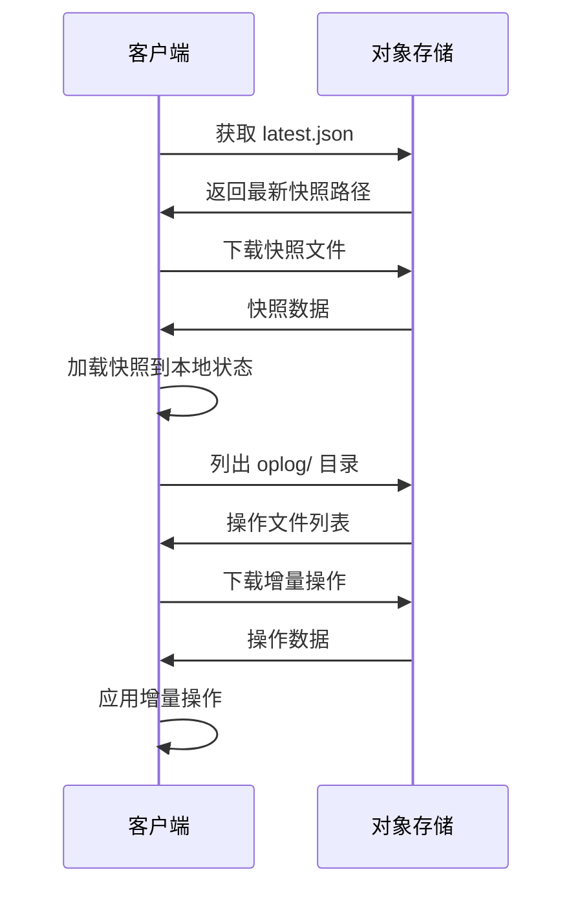
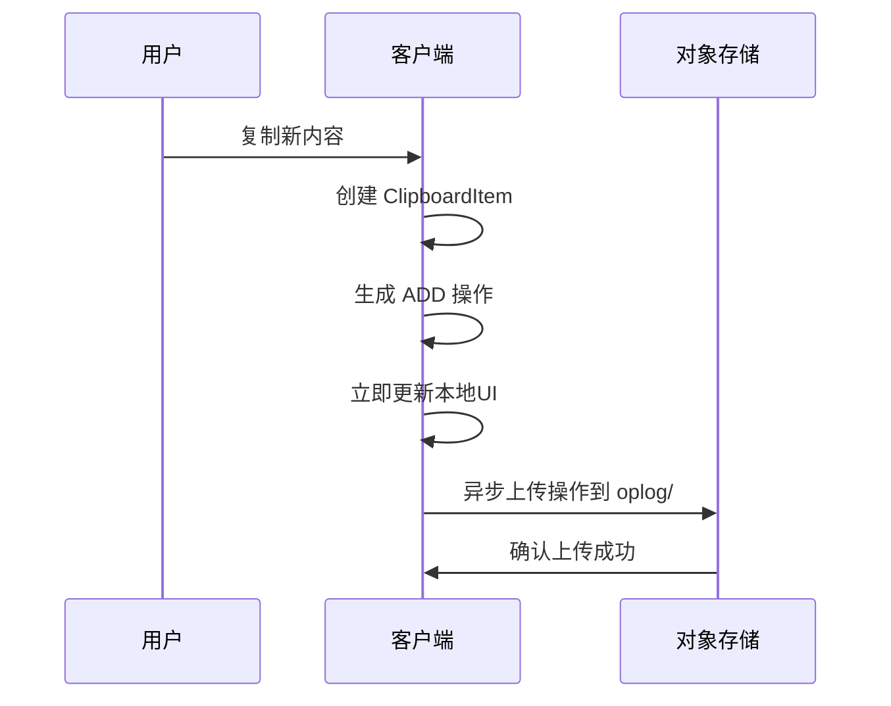
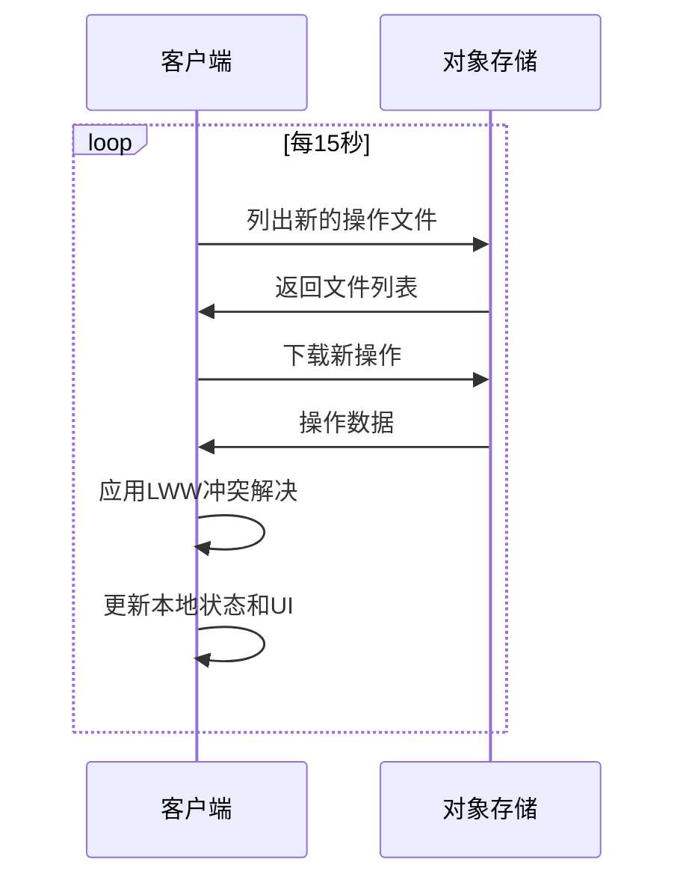
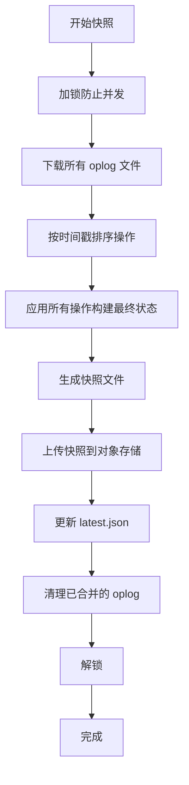

# Clippy 同步架构文档

基于 **LWW-Oplog + 对象存储** 的多端剪切板同步解决方案

## 架构概览

### 核心组件

1. **客户端 (Client Application)**
   - 运行在各个平台（Windows, macOS, Linux）
   - 监听系统剪切板变化
   - 维护本地 SQLite 数据库
   - 执行 LWW 冲突解决
   - 与对象存储同步

2. **对象存储 (Object Storage)**
   - 作为所有客户端的"公告板"
   - 支持多种后端：AWS S3, 阿里云 OSS, MinIO, 腾讯云 COS, Azure Blob 等
   - 存储操作日志和状态快照

3. **同步引擎 (Sync Engine)**
   - 实现 LWW (Last-Write-Wins) 冲突解决
   - 管理操作日志 (Oplog)
   - 生成和加载状态快照

## 数据结构设计

### 剪切板条目 (ClipboardItem)

```rust
#[derive(Debug, Clone, Serialize, Deserialize)]
pub struct SyncClipboardItem {
    pub id: String,                    // 全局唯一ID (UUIDv4)
    pub content_type: String,          // 内容类型 ("text/plain", "image/png", etc.)
    pub content: String,               // 剪切板内容
    pub created_at: DateTime<Utc>,     // 创建时间戳 (ISO 8601 UTC)
    pub metadata: ItemMetadata,        // 元数据
}

#[derive(Debug, Clone, Serialize, Deserialize)]
pub struct ItemMetadata {
    pub source_device: String,         // 来源设备名
    pub source_app: Option<String>,    // 来源应用名
    pub content_hash: Option<String>,  // 用于大文件的内容引用
}
```

### 操作记录 (Operation)

```rust
#[derive(Debug, Clone, Serialize, Deserialize)]
pub struct Operation {
    pub op_id: String,                     // 操作唯一ID (UUIDv4)
    pub op_type: OpType,                   // 操作类型：ADD | DELETE
    pub target_id: String,                 // 目标 ClipboardItem 的 ID
    pub timestamp: DateTime<Utc>,          // LWW的关键：高精度UTC时间戳
    pub device_id: String,                 // 设备ID，用于打破时间戳平局
    pub payload: Option<SyncClipboardItem>, // ADD时包含数据，DELETE时为None
}
```

### 状态快照 (Snapshot)

```rust
#[derive(Debug, Clone, Serialize, Deserialize)]
pub struct Snapshot {
    pub items: Vec<SyncClipboardItem>,     // 当前所有有效项目
    pub snapshot_timestamp: DateTime<Utc>, // 快照生成时间
    pub last_op_timestamp: DateTime<Utc>,  // 基于的最后操作时间戳
    pub device_id: String,                 // 生成快照的设备
}
```

## 对象存储结构

```
/clipboard-data/
└── {userID}/
    ├── oplog/
    │   ├── {opId_1}.json          # 操作日志文件
    │   ├── {opId_2}.json
    │   └── ...
    ├── snapshots/
    │   ├── {timestamp}_snapshot.json  # 状态快照
    │   └── latest.json            # 指向最新快照
    └── data/                      # 大文件存储（可选）
        └── {content_hash}/
```

## 同步流程

### 1. 初始化同步



### 2. 本地操作 (ADD)



### 3. 增量同步



## LWW 冲突解决算法

### 基本原则

1. **时间戳优先**：较新的时间戳获胜
2. **设备ID决胜**：时间戳相同时，比较设备ID的字典序
3. **删除优先**：DELETE 操作优先于 ADD 操作（当时间戳较新时）

### 实现逻辑

```rust
impl Operation {
    pub fn is_newer_than(&self, other: &Operation) -> bool {
        match self.timestamp.cmp(&other.timestamp) {
            std::cmp::Ordering::Greater => true,
            std::cmp::Ordering::Less => false,
            std::cmp::Ordering::Equal => {
                // 时间戳相同时，比较设备ID的字典序
                self.device_id > other.device_id
            }
        }
    }
}
```

### 应用操作规则

```rust
async fn apply_operations(&self, ops: Vec<Operation>) -> Result<()> {
    for op in ops {
        match op.op_type {
            OpType::Add => {
                if let Some(item) = &op.payload {
                    // 检查冲突，较新的获胜
                    if let Some(existing) = state.items.get(&op.target_id) {
                        if item.created_at >= existing.created_at {
                            state.items.insert(op.target_id.clone(), item.clone());
                        }
                    } else {
                        state.items.insert(op.target_id.clone(), item.clone());
                    }
                }
            }
            OpType::Delete => {
                // 只有当删除时间戳晚于项目创建时间才删除
                if let Some(existing) = state.items.get(&op.target_id) {
                    if op.timestamp >= existing.created_at {
                        state.items.remove(&op.target_id);
                    }
                }
            }
        }
    }
}
```

## 快照机制

### 生成时机

1. **定时生成**：每天定时生成一次快照
2. **操作数量**：当 oplog 文件数量超过阈值时
3. **手动触发**：用户手动触发清理操作

### 生成流程



## 存储后端配置

### 支持的存储后端

1. **本地文件系统** - 开发测试
2. **AWS S3** - 生产环境
3. **阿里云 OSS** - 中国区域
4. **MinIO** - 自建私有云
5. **腾讯云 COS** - 国内云服务
6. **Azure Blob Storage** - 微软云

### 配置示例

```json
{
  "backend": {
    "S3": {
      "bucket": "my-clippy-bucket",
      "region": "us-east-1",
      "access_key_id": "your_access_key",
      "secret_access_key": "your_secret_key"
    }
  },
  "retry_attempts": 3,
  "timeout_seconds": 30
}
```

### 环境变量配置

```bash
# AWS S3
export AWS_S3_BUCKET=my-clippy-bucket
export AWS_REGION=us-east-1
export AWS_ACCESS_KEY_ID=your_access_key
export AWS_SECRET_ACCESS_KEY=your_secret_key

# MinIO
export MINIO_BUCKET=clippy
export MINIO_ENDPOINT=http://localhost:9000
export MINIO_ACCESS_KEY=minioadmin
export MINIO_SECRET_KEY=minioadmin

# 用户ID
export CLIPPY_USER_ID=your_unique_user_id
```

## 安全考虑

### 1. 端到端加密 (E2EE)

```rust
// 推荐在上传前加密 content 字段
pub struct EncryptedClipboardItem {
    pub id: String,
    pub content_type: String,
    pub encrypted_content: String,  // 加密后的内容
    pub created_at: DateTime<Utc>,
    pub metadata: ItemMetadata,
}
```

### 2. 访问控制

- 每个用户只能访问自己的目录 (`/{userID}/*`)
- 使用 IAM 策略限制访问权限
- 定期轮换访问密钥

### 3. 数据隔离

- 用户数据完全隔离
- 支持多租户架构
- 可配置数据保留策略

## 性能优化

### 1. 网络优化

- 重试机制处理网络波动
- 并发上传/下载操作
- 增量同步减少传输量

### 2. 存储优化

- 定期快照合并减少文件数量
- 大文件内容外部存储
- 压缩操作日志

### 3. 本地优化

- 内存索引加速查询
- 延迟加载大内容
- 本地缓存远程数据

## 故障处理

### 1. 网络断开

- 本地操作暂存到待上传队列
- 网络恢复后自动批量上传
- 保证操作不丢失

### 2. 冲突解决

- LWW 算法保证最终一致性
- 冲突时保留最新数据
- 用户可查看冲突历史

### 3. 数据恢复

- 快照提供数据恢复点
- 操作日志可重放恢复
- 支持导出备份数据

## 部署建议

### 1. 生产环境

- 使用高可用对象存储
- 配置跨区域备份
- 监控同步状态和错误

### 2. 测试环境

- 使用本地 MinIO 模拟
- 独立的测试数据
- 自动化测试覆盖

### 3. 开发环境

- 本地文件系统存储
- 快速迭代和调试
- 模拟各种故障场景

这个架构设计提供了一个完整、可扩展、高可用的多端剪切板同步解决方案，能够很好地处理离线场景、冲突解决和数据一致性问题。 